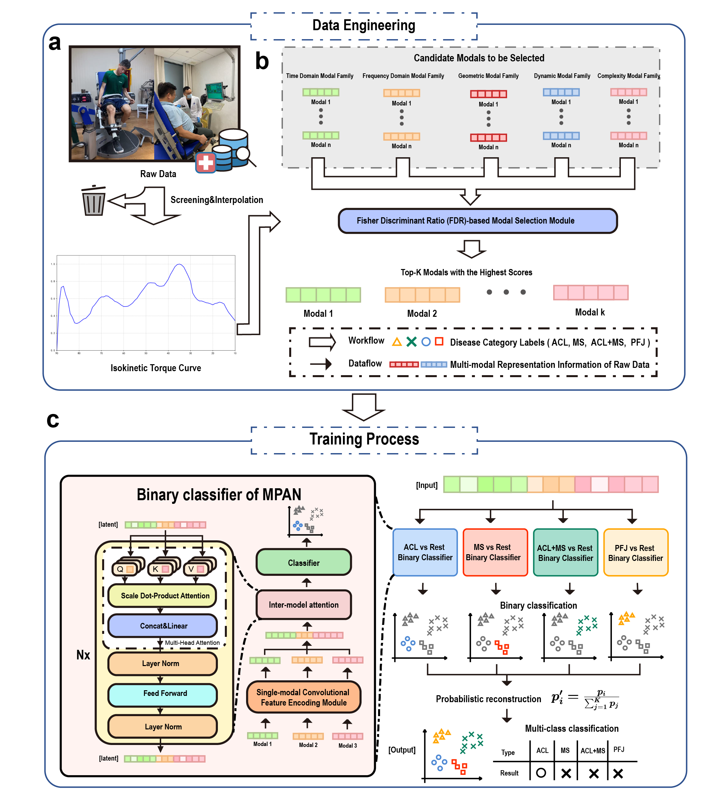
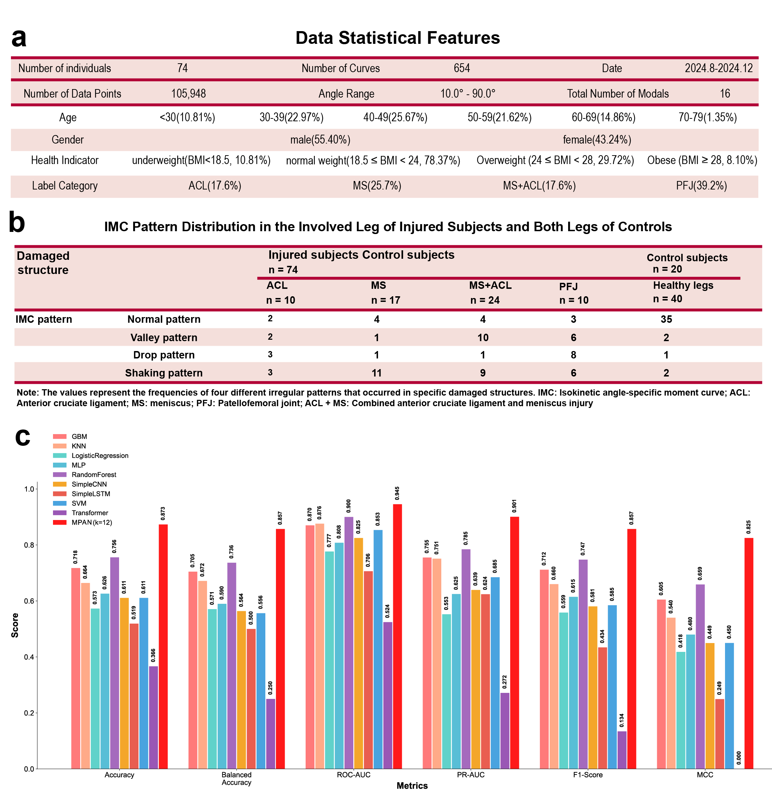
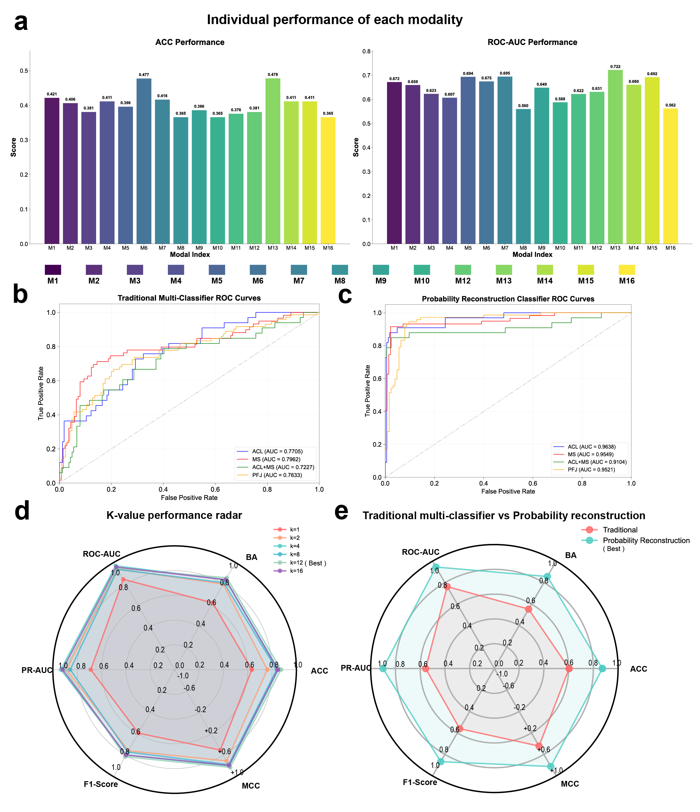

<<<<<<< HEAD
# MPAN - Multi-modal Probabilistic Attention Network

多模态概率注意力网络 | 多模态分类框架

---

## English Version

### Project Overview



MPAN is a deep learning-based multi-modal data processing and classification system, specifically designed for time series curve data (e.g., angle-torque curves from IMC tests). The project implements various advanced neural network architectures, including Transformer attention mechanisms and probabilistic reconstruction classifiers, for high-precision multi-classification tasks.

### Data Description

| Property | Value |
|----------|-------|
| Valid Samples | 654 (after processing) |
| Original Samples | 721, with 67 outliers removed |
| Data Shape | (samples, 81 timesteps, 2 channels) |
| Modal Features | 16 types |
| Classification | 4 classes (a, b, c, d) |
| Class Distribution | a:110, b:196, c:109, d:239 |

### Project Structure

```
MPAN/
├── script/                    # Core scripts
│   ├── DataCleanandSave16Modal_label.py    # Data cleaning & feature extraction
│   ├── interpretability.py                 # Complete data processing pipeline
│   ├── interpretability_simple.py          # Simplified version
│   ├── modal_interpretability_analysis.py  # Modal interpretability analysis
│   ├── Supervised_learnV3_ModalAttentionCombineV12MutiClassfier_PNormalize.py  # Main training script
│   ├── baseline_models.py                  # Baseline model comparison
│   ├── model_evaluation_script.py          # Model evaluation
│   ├── plot_all_curves.py                  # Curve visualization
│   └── ...
├── data/                      # Data directory
│   └── processed/            # Processed data
├── result/                   # Experiment results
│   └── summary/              # Result summary
├── check_result/             # Result checking
├── analyze_class_distribution.py  # Class distribution analysis
└── .vscode/                  # VSCode configuration
```

### Main Features

#### 1. Data Processing
- Load from raw Excel data
- Torque normalization
- Outlier detection (based on gradient variance and segment analysis)
- 16 modal feature computation

#### 2. Neural Network Models
- **SingleModalNet**: Single-modal neural network
- **TransformerBlock**: Transformer block
- **TransformerAttentionFusion**: Transformer-based multi-modal attention fusion
- **AttentionFusion**: Classical attention fusion
- **ClassifierNet**: Multi-modal classifier network

#### 3. Baseline Models
- CNN (Convolutional Neural Network)
- LSTM (Long Short-Term Memory)
- Transformer (3-layer attention)
- MLP (Multi-Layer Perceptron)
- Traditional ML (SVM, Random Forest, etc.)

#### 4. Probabilistic Reconstruction Classifier

Unique probabilistic reconstruction method that converts multi-classification into multiple binary classification problems, then reconstructs the final multi-class probabilities. Supports multiple reconstruction strategies:
- Simple Normalize
- Calibrated Normalize
- Softmax Normalize

#### 5. Model Evaluation & Visualization
- ROC curve analysis
- Accuracy, Precision, Recall, F1-score
- AUC-ROC evaluation
- Modal importance analysis
- Classifier comparison radar chart



### Environment Dependencies

```
numpy>=1.19.0
pandas>=1.0.0
scikit-learn>=0.24.0
torch>=1.8.0
matplotlib>=3.3.0
seaborn>=0.11.0
openpyxl>=3.0.0
```

### Usage

#### 1. Data Preprocessing

```python
from script.interpretability import quick_process_complete_pipeline

# Process raw data
quick_process_complete_pipeline(
    data_path='path/to/your/data.xlsx',
    output_dir='data/processed',
    outlier_method='gradient2'
)
```

#### 2. Train Model

```python
from script.Supervised_learnV3_ModalAttentionCombineV12MutiClassfier_PNormalize import ProbabilityReconstructionClassifier

# Initialize classifier
classifier = ProbabilityReconstructionClassifier(
    k_modals=8,
    device='cuda',
    reconstruction_method='simple_normalize'
)

# Train
results = classifier.train_all(
    modal_features, labels,
    k_modals=8,
    num_epochs=100,
    batch_size=32,
    use_transformer_attention=True
)
```

#### 3. Model Evaluation

```python
# Evaluate all methods
all_results = classifier.evaluate_all_methods(modal_features, true_labels)

# Plot comparison
classifier.plot_comparison(results)
```

#### 4. Run Baseline Comparison

```python
from script.baseline_models import BaselineModels

baseline = BaselineModels()
baseline.run_baseline_comparison(modal_features, labels, k_modals=8)
```

### Main Scripts

| Script | Description |
|--------|-------------|
| `DataCleanandSave16Modal_label.py` | Raw data cleaning and saving |
| `interpretability.py` | Complete data processing pipeline |
| `Supervised_learnV3_...py` | Main training and evaluation script |
| `baseline_models.py` | Baseline model comparison |
| `model_evaluation_script.py` | Comprehensive model evaluation |
| `analyze_class_distribution.py` | Data distribution analysis |

### Notes

1. **Data Path**: Modify paths according to your actual data location
2. **GPU Support**: CUDA required for training large models
3. **Memory**: Ensure sufficient memory for large-scale data processing



---

## 中文版本

### 项目概述


MPAN是一个基于深度学习的多模态数据处理与分类系统，专门设计用于处理时间序列曲线数据（如IMC测试中的角度-扭矩曲线）。该项目实现了多种先进的神经网络架构，包括Transformer注意力机制和概率重构分类器，用于高精度的多分类任务。

### 数据说明

| 属性 | 值 |
|------|-----|
| 有效样本数 | 654个（处理后） |
| 原始样本数 | 721个，移除异常值67个 |
| 数据维度 | (样本数, 81时间步, 2通道) |
| 模态特征 | 16种 |
| 分类类别 | 4类 (a, b, c, d) |
| 类别分布 | a:110, b:196, c:109, d:239 |

### 项目结构

```
MPAN/
├── script/                    # 核心脚本
│   ├── DataCleanandSave16Modal_label.py    # 数据清洗和特征提取
│   ├── interpretability.py                 # 完整数据处理流水线
│   ├── interpretability_simple.py          # 简化版
│   ├── modal_interpretability_analysis.py  # 模态可解释性分析
│   ├── Supervised_learnV3_ModalAttentionCombineV12MutiClassfier_PNormalize.py  # 主训练脚本
│   ├── baseline_models.py                  # 基线模型对比
│   ├── model_evaluation_script.py          # 模型评估
│   ├── plot_all_curves.py                  # 曲线可视化
│   └── ...
├── data/                      # 数据目录
│   └── processed/            # 处理后的数据
├── result/                   # 实验结果
│   └── summary/              # 结果汇总
├── check_result/             # 结果检查
├── analyze_class_distribution.py  # 类别分布分析
└── .vscode/                  # VSCode配置
```

### 主要功能

#### 1. 数据处理
- 从原始Excel数据加载
- 扭矩归一化处理
- 异常值检测（基于梯度方差和段落分析）
- 16种模态特征计算

#### 2. 神经网络模型
- **SingleModalNet**: 单模态神经网络
- **TransformerBlock**: Transformer块
- **TransformerAttentionFusion**: 基于Transformer的多模态注意力融合
- **AttentionFusion**: 经典注意力融合
- **ClassifierNet**: 多模态分类器网络

#### 3. 基线模型
- CNN (卷积神经网络)
- LSTM (长短期记忆网络)
- Transformer (三层注意力)
- MLP (多层感知机)
- 传统机器学习 (SVM, Random Forest等)

#### 4. 概率重构分类器

独特的概率重构方法，将多分类问题转换为多个二分类问题，然后通过概率重构得到最终的多分类结果。支持多种重构策略：
- 简单归一化 (simple_normalize)
- 校准归一化 (calibrated_normalize)
- Softmax归一化

#### 5. 模型评估与可视化
- ROC曲线分析
- 准确率、精确率、召回率、F1分数
- AUC-ROC评估
- 模态重要性分析
- 分类器对比雷达图


### 环境依赖

```
numpy>=1.19.0
pandas>=1.0.0
scikit-learn>=0.24.0
torch>=1.8.0
matplotlib>=3.3.0
seaborn>=0.11.0
openpyxl>=3.0.0
```

### 使用方法

#### 1. 数据预处理

```python
from script.interpretability import quick_process_complete_pipeline

# 处理原始数据
quick_process_complete_pipeline(
    data_path='path/to/your/data.xlsx',
    output_dir='data/processed',
    outlier_method='gradient2'
)
```

#### 2. 训练模型

```python
from script.Supervised_learnV3_ModalAttentionCombineV12MutiClassfier_PNormalize import ProbabilityReconstructionClassifier

# 初始化分类器
classifier = ProbabilityReconstructionClassifier(
    k_modals=8,
    device='cuda',
    reconstruction_method='simple_normalize'
)

# 训练
results = classifier.train_all(
    modal_features, labels,
    k_modals=8,
    num_epochs=100,
    batch_size=32,
    use_transformer_attention=True
)
```

#### 3. 模型评估

```python
# 评估所有方法
all_results = classifier.evaluate_all_methods(modal_features, true_labels)

# 绘制比较图
classifier.plot_comparison(results)
```

#### 4. 运行基线对比

```python
from script.baseline_models import BaselineModels

baseline = BaselineModels()
baseline.run_baseline_comparison(modal_features, labels, k_modals=8)
```

### 主要脚本

| 脚本 | 功能 |
|------|------|
| `DataCleanandSave16Modal_label.py` | 原始数据清洗和保存 |
| `interpretability.py` | 完整的数据处理流水线 |
| `Supervised_learnV3_...py` | 主要的训练和评估脚本 |
| `baseline_models.py` | 基线模型对比实验 |
| `model_evaluation_script.py` | 模型综合评估 |
| `analyze_class_distribution.py` | 数据分布分析 |

### 注意事项

1. **数据路径**：根据实际数据位置修改路径
2. **GPU支持**：训练大型模型需要CUDA支持
3. **内存要求**：处理大规模数据时需要足够内存


---

## License | 许可证

MIT License
=======
